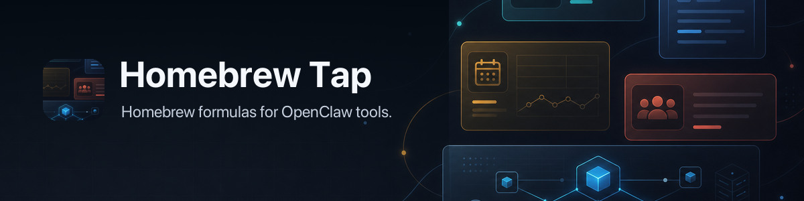

# OpenClaw Homebrew Tap



Homebrew tap for shipping OpenClaw CLI tools.

## Install

```bash
brew tap openclaw/tap
```

## Install Packages

```bash
# formula
brew install openclaw/tap/<name>

# cask
brew install --cask openclaw/tap/<name>
```

## Packages

### Formulae

- `crabbox` — Remote Linux test boxes for dirty worktrees and CI hydration
- `discrawl` — Mirror Discord into SQLite and search server history locally
- `gitcrawl` — Local GitHub issue and PR archive with gh-compatible caching
- `gogcli` — Google CLI for Gmail, Calendar, Drive, Docs, Sheets, and more
- `goplaces` — Modern Go client + CLI for the Google Places API (New)
- `graincrawl` — Local-first Granola crawler into SQLite and Markdown
- `notcrawl` — Local-first Notion crawler into SQLite and normalized Markdown
- `slacrawl` — Go-based CLI for mirroring Slack workspace data into local SQLite
- `wacli` — WhatsApp CLI built on whatsmeow

### Casks

None, yet

## Update / Uninstall

```bash
brew update
brew upgrade

brew uninstall <formula>
brew uninstall --cask <cask>

# casks only: remove user data
brew uninstall --cask --zap openclaw/tap/<name>
```

## Notes

- Run `brew info openclaw/tap/<name>` for per-tool caveats (permissions, setup steps, etc.).
