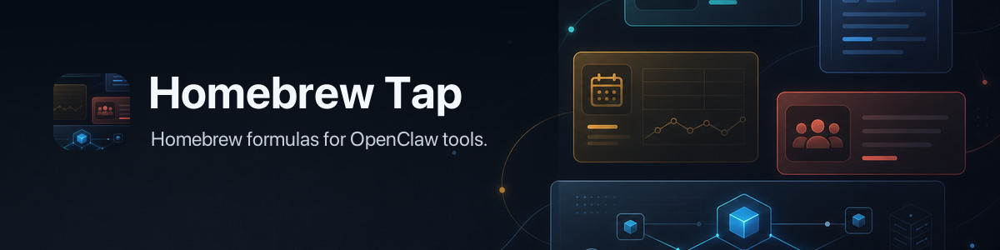

# OpenClaw Homebrew Tap



Homebrew tap for shipping OpenClaw CLI tools.

## Install

```bash
brew tap openclaw/tap
```

## Install Packages

```bash
# formula
brew install openclaw/tap/<name>

# cask
brew install --cask openclaw/tap/<name>
```

## Packages

### Formulae

- `axorc` — Inspect and automate macOS Accessibility from the shell
- `clawscan` — Agent-skill security scanner harness for ClawHub
- `crabbox` — Remote Linux test boxes for dirty worktrees and CI hydration
- `crabfleet` — Fleet management CLI for Crabbox workers
- `crawlbar` — macOS menu bar control plane for local-first crawler CLIs
- `discrawl` — Mirror Discord into SQLite and search server history locally
- `gitcrawl` — Local GitHub issue and PR archive, search, and clustering
- `gogcli` — Google CLI for Gmail, Calendar, Drive, Docs, Sheets, and more
- `graincrawl` — Local-first Granola crawler into SQLite and Markdown
- `notcrawl` — Local-first Notion crawler into SQLite and normalized Markdown
- `octopool` — Org-authenticated GitHub read relay and gh-compatible cache shim
- `slacrawl` — Go-based CLI for mirroring Slack workspace data into local SQLite
- `telecrawl` — Telegram Desktop archive CLI with encrypted Git backups
- `wacli` — WhatsApp CLI built on whatsmeow
- `wacrawl` — Read-only WhatsApp Desktop archive CLI

### Casks

- `goplaces` — Modern Go client + CLI for the Google Places API (New)

## Update / Uninstall

```bash
brew update
brew upgrade

brew uninstall <formula>
brew uninstall --cask <cask>

# casks only: remove user data
brew uninstall --cask --zap openclaw/tap/<name>
```

## Notes

- Run `brew info openclaw/tap/<name>` for per-tool caveats (permissions, setup steps, etc.).

## Maintainers

Formula updates have two automated paths. Source-repository release workflows dispatch
`Update Formula` for immediate updates. That workflow accepts a Homebrew formula token, a semantic release tag, and a
GitHub repository in `owner/repo` form. Optional artifact inputs must resolve to HTTPS release
assets and may use only the placeholders documented by the workflow. Downloads use a 30-second
socket inactivity timeout and stream archive bytes without imposing a size limit. This timeout
bounds stalled socket operations, not the total duration of a progressing download.

**Crabbox uses the ordinary four-target `assets` handoff after publication.** The
[Crabbox release process](https://github.com/openclaw/crabbox/blob/main/docs/RELEASING.md)
completes its prepublication checks, including native proof, before publishing. Publication
establishes tap eligibility: the operator explicitly dispatches `Update Formula` with the tag and
four published archive names/hashes. The updater downloads and hashes all four canonical GitHub
release assets before writing, preserves maintained formula content, and succeeds when already
current. Reconciliation is an independent fallback for stable published releases. Retry a failed tap
handoff on its own; do not rebuild or republish to retry Homebrew.

Public native and proxy-only Go-install smokes remain required independent channel health checks,
not an additional approval gate for the tap. Installed-Homebrew smoke follows the update.
Crabbox's obsolete `verified-hashes-v1` write mode fails with guidance to use ordinary `assets`;
caller-supplied hashes without public downloads cannot update that formula. Its read-only
`--verify-source-tag-only` check still accepts the complete verified-hash input set without writing.

Existing `Formula/*.rb` files own each tool's caveats and install instructions. The updater
preserves that content while changing release metadata, so maintain it here rather than in an
upstream release workflow. For Gitcrawl, see the [configuration reference](https://gitcrawl.sh/configuration/)
and [gh shim migration to Octopool](https://gitcrawl.sh/gh-shim/).

`Reconcile Formulae` is the self-healing fallback for formulae. Every three hours
it derives each source repository from the formula's GitHub `homepage`, compares the formula with that repository's latest
stable published release, and runs the same updater and checksum-download logic when the release is
newer. It never downgrades, skips drafts and prereleases, and makes no commit when every formula is
current. Manual reconciles default to dry-run and can target one formula. The reconciler reads public
release metadata and pushes with this tap's own `GITHUB_TOKEN`; it needs no cross-repository token or
other external credential. The dispatch path remains the preferred low-latency path.

Pull requests and updates to `main` run the updater and reconciler tests and validate every formula's
Ruby syntax.

Fleet release workflows use the optional `assets` JSON contract: exactly one `name` and `sha256`
for each Darwin/Linux amd64/arm64 target. The updater renders those names and hashes verbatim,
downloads all four public release assets, and refuses to commit on any digest mismatch. Omitting
`assets` preserves the legacy template and filename-guessing behavior for older callers.

Other four-target binary releases can use the workflow's `verified-hashes-v1` contract. Supply all four
canonical target SHA-256 inputs, `source_tag_object`, `source_tag_commit`, and `request_id` with an
explicit `{target}` artifact template. This mode requires an existing formula, checks that the live
source ref is the supplied annotated tag object and peeled commit, renders the target URL/checksum
pairs directly from the supplied hashes, and never downloads release assets to recompute them.
Partial or mixed legacy/verified input sets fail closed. The source repository remains responsible
for verifying the public release bytes immediately before dispatch and again after the tap update,
including its clean downstream Homebrew install proof.

Each successful verified dispatch must create one direct-child provenance commit; an already-current
formula fails closed instead of reporting a trailerless no-op. The workflow revalidates the exact
public source tag without credentials immediately before its one-shot push and again after proving
that the remote tap branch equals the pushed commit.

Verified run titles are `Update <formula> for <tag> (request-id=<id>;
source-tag-object=<object>; source-tag-commit=<commit>)`. A changed formula commit records
`Source-Repository`, `Source-Tag-Object`, `Source-Tag-Commit`, and `Request-ID` trailers so callers
can bind the protected workflow run, resulting tap commit, and formula bytes to one handoff.
